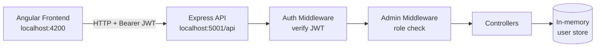

# SK Verify Portal

A full-stack, role-based authentication and verification dashboard built with **Angular, Node.js, Express, and TypeScript**. It demonstrates secure JWT login, frontend and backend access control, admin-level user management, and asynchronous data loading with a simulated API delay.


---

## Table of Contents

1. [Overview](#overview)
2. [Key Features](#key-features)
3. [Technology Stack](#technology-stack)
4. [Architecture](#architecture)
5. [Project Structure](#project-structure)
6. [Getting Started](#getting-started)
7. [Demo Accounts](#demo-accounts)
8. [Application Routes](#application-routes)
9. [API Reference](#api-reference)
10. [Security Design](#security-design)
11. [Testing and Verification](#testing-and-verification)
12. [Known Limitations](#known-limitations)
13. [Future Improvements](#future-improvements)
14. [Author](#author)

---

## Overview

SK Verify Portal lets users sign in with a **User ID, password, and role**, then view their profile and a set of verification records. Administrators additionally have access to a user-management interface for creating, viewing, updating, and deleting accounts.

Access is enforced in two independent layers:

- **Frontend:** Angular route guards control navigation.
- **Backend:** JWT authentication and Admin-role middleware protect the API, so restrictions hold even if the UI is bypassed.

## Key Features

| Area | Description |
|---|---|
| **Authentication** | Login with User ID, password, and role. Passwords are hashed with bcryptjs; sessions use JWT. |
| **Role-based access control** | Distinct permissions for **Admin** and **General User** accounts. |
| **Dashboard** | Shows the authenticated user's details and verification records. |
| **Async data handling** | Records endpoint accepts a configurable delay (`?delay=3000`) to demonstrate loading states. |
| **User management** | Admins can create, list, update, and delete users. |
| **Route protection** | Angular guards protect authenticated pages and restrict the Admin interface. |
| **Reusable service layer** | A centralized Angular `UserService` handles all user-management HTTP calls. |
| **Secure logout** | Clears the stored token and user information and redirects to login. |


| Login | Dashboard | User Management |
|---|---|---|
|  |  |  |

## Technology Stack

| Layer | Technologies |
|---|---|
| Frontend | Angular 22 (standalone components, signals), RxJS, TypeScript, SCSS |
| Backend | Node.js, Express, TypeScript |
| Authentication | JSON Web Tokens (JWT), bcryptjs |
| API communication | HTTP REST APIs |
| Tooling | Angular CLI, npm, Git |

## Architecture



**Login flow**

1. The user submits User ID, password, and role to `POST /api/auth/login`.
2. The backend validates the credentials against the stored bcrypt hash.
3. On success, a signed JWT is returned and stored by the client.
4. Subsequent requests send the token in the `Authorization: Bearer <token>` header.
5. Middleware verifies the token on every protected route; Admin-only routes additionally check the user's role.

## Project Structure

```text
sk-verify-portal/
├── frontend/
│   └── src/app/
│       ├── core/            # API config and HTTP auth interceptor
│       ├── guards/          # Functional auth and admin route guards
│       ├── models/          # Shared TypeScript interfaces
│       ├── pages/           # Lazy-loaded: login, dashboard, users
│       ├── services/        # Auth, User and Record services (HttpClient + RxJS)
│       ├── app.config.ts    # Providers, interceptor, app initializer
│       └── app.routes.ts    # Lazy-loaded routes
├── backend/
│   └── src/
│       ├── controllers/     # Request handlers
│       ├── middleware/      # JWT auth and Admin authorization
│       ├── routes/
│       ├── data/            # Seeded in-memory data
│       ├── types/
│       └── utils/
└── README.md
```
## Angular Highlights

- **App initializer** (`provideAppInitializer`): restores the session by calling `/api/me` before the app renders, so a page refresh keeps the user logged in.
- **HTTP interceptor**: attaches the JWT to every request and logs the user out on a 401 response.
- **Lazy loading**: each page is loaded on demand with `loadComponent`.
- **Functional route guards**: `authGuard` and `adminGuard`.
- **Signals and RxJS**: shared auth state is held in signals, and all API calls use `HttpClient` Observables.
- **Async processing**: the dashboard requests records and (for admins) the user list in parallel. The records request accepts a delay parameter (`?delay=3000`) and shows skeleton loaders while it waits.
- **Service layer**: `Auth`, `UserService` and `RecordService` keep HTTP code out of the components.

## Getting Started

### Prerequisites

- Node.js and npm
- Angular CLI compatible with the installed Angular version
- Git

### 1. Clone the repository

```bash
git clone https://github.com/Shivangi-projects/sk-verify-portal.git
cd sk-verify-portal
```

### 2. Configure and start the backend

```bash
cd backend
npm install
```

Create a `.env` file in `backend/` using the variable names expected by the backend configuration, including a **strong, unique JWT secret**.

> **Never commit `.env` files or secrets to version control.**

```bash
npm run dev
```

The API runs on **http://localhost:5001**.

### 3. Start the frontend

In a second terminal:

```bash
cd frontend
npm install
npm start
```

Open **http://localhost:4200** in your browser.

## Demo Accounts

Seeded accounts for local testing:

| Role | User ID | Password |
|---|---|---|
| Admin | `admin` | `admin123` |
| General User | `user1` | `user123` |

> These are development credentials only and must be replaced before any production deployment.

## Application Routes

| Route | Access | Purpose |
|---|---|---|
| `/` | Public | Login page |
| `/dashboard` | Authenticated users | User details and verification records |
| `/users` | Admin only | User administration |

## API Reference

**Base URL:** `http://localhost:5001/api`

Protected endpoints require:

```text
Authorization: Bearer <token>
```

### Authentication and dashboard

| Method | Endpoint | Auth | Purpose |
|---|---|---|---|
| `POST` | `/auth/login` | Public | Authenticate a user and receive a JWT |
| `GET` | `/me` | Authenticated | Retrieve the current user's details |
| `GET` | `/records?delay=3000` | Authenticated | Retrieve verification records with a simulated delay (ms) |

The `delay` parameter is capped on the server to prevent excessively long requests.

### User administration (Admin only)

| Method | Endpoint | Purpose |
|---|---|---|
| `GET` | `/users` | List users |
| `POST` | `/users` | Create a user |
| `PUT` | `/users/:id` | Update a user |
| `DELETE` | `/users/:id` | Delete a user |

### Example request

```bash
# 1. Log in
curl -X POST http://localhost:5001/api/auth/login \
  -H "Content-Type: application/json" \
  -d '{"userId":"admin","password":"admin123","role":"Admin"}'

# 2. Use the returned token
curl http://localhost:5001/api/users \
  -H "Authorization: Bearer <token>"
```

> The login payload above is illustrative; adjust field names to match the backend's request schema.

## Security Design

- **Password hashing:** Passwords are stored as bcrypt hashes, never in plain text.
- **Stateless sessions:** Authentication uses signed JWTs verified on every protected request.
- **Defense in depth:** Frontend guards improve UX, while backend middleware is the actual security boundary.
- **Least privilege:** User-management endpoints are restricted to Admin accounts.
- **Input bounds:** The simulated delay parameter is capped server-side.
- **Secrets management:** Configuration secrets live in an untracked `.env` file.

## Testing and Verification

### Build and type checks

```bash
# Frontend production build
cd frontend && npx ng build

# Backend TypeScript check
cd backend && npx tsc --noEmit
```

### Manual test checklist

- [ ] Log in as both Admin and General User.
- [ ] Confirm authenticated users can open the dashboard.
- [ ] Confirm General Users are blocked from `/users`.
- [ ] As Admin, create, edit, and delete a test user.
- [ ] Confirm user-management APIs reject missing, invalid, or non-Admin tokens.
- [ ] Confirm the loading indicator appears during the simulated records delay.
- [ ] Log out and confirm protected routes redirect to login.

## Known Limitations

- **In-memory storage:** User data is not persisted; changes are lost when the backend restarts.
- **Local configuration:** API URLs target local development. Update them before deploying frontend and backend to separate hosts.
- **Demo credentials:** Included for local evaluation only.

## Future Improvements

- Persistent database (e.g., PostgreSQL or MongoDB) with migrations.
- Automated unit, integration, and end-to-end tests with CI.
- Refresh tokens and httpOnly cookie-based session storage.
- Rate limiting and account lockout on repeated failed logins.
- Environment-specific configuration and Docker-based deployment.
- Audit logging for administrative actions.

## Author

**Shivangi Kakkar**
GitHub: [Shivangi-projects](https://github.com/Shivangi-projects)